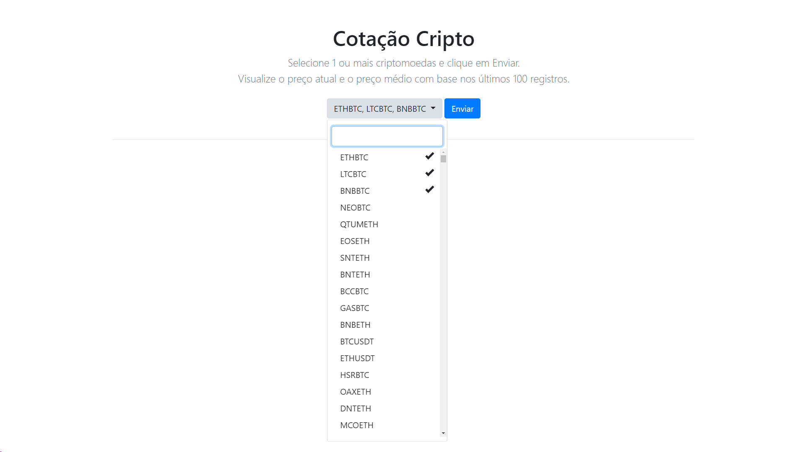
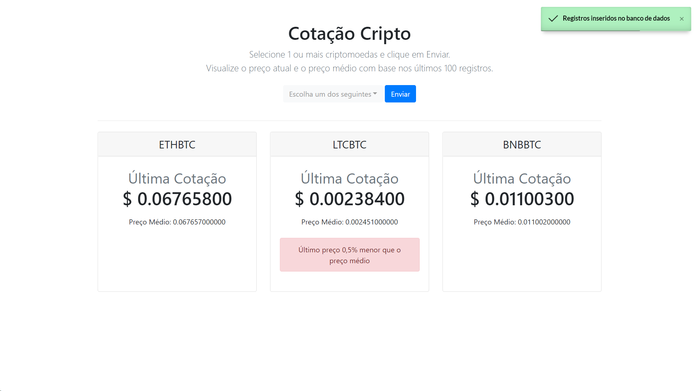

# cotacao-cripto
 
Selecione a(s) criptomoeda(s) e clique em Enviar, será exibido o preço da última cotação e o preço médio dos últimos 100 registros. Sistema lista todas as criptomoedas utilizando a API da [Binance](https://www.binance.com/pt-BR).

### API
API é a sigla de Application Programming Interface, que serve como intermediária na comunicação entre dois softwares. Ou seja, é uma forma de integração entre sistemas que fornece segurança de dados e intercâmbio de informações com diferentes linguagens de programação.

A API utilizada é da Binance:
- [Change Log](https://binance-docs.github.io/apidocs/#change-log).
- [Symbol Price Ticker](https://binance-docs.github.io/apidocs/#symbol-price-ticker).

### Instalação
Clonar repositório e importar o banco de dados que se encontra em `banco/bd_binance.sql`

### Telas

### Tecnologias
- PHP 7.4.26
- MySQL 5.7.36
- Bootstrap 4.0
- [iziToast](https://github.com/marcelodolza)

### License
MIT
**Free Software, Hell Yeah!**